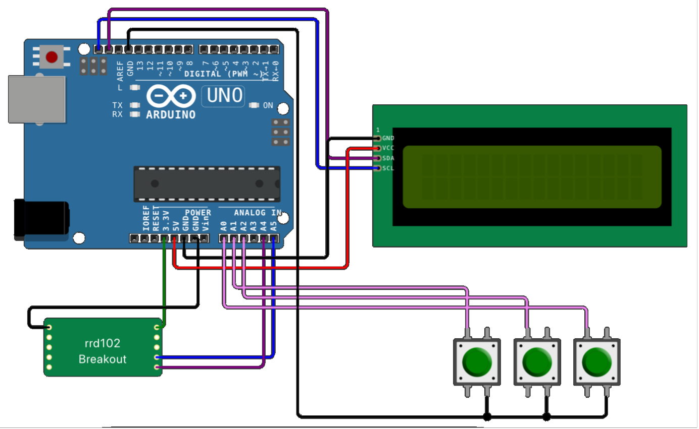

[Klikněte zde pro zobrazení české verze](README-CS.md)

# FM Radio (ArduRadio v1.0)

FM Radio made with Arduino UNO.

## Features

- Power Saving Mode
- Multiple screens
- Stereo sound
- Bass Boost

## Build your own ArduRadio!

### Bill of Materials

- Arduino UNO R3 (or equivalent; see notes)
- 16x2 LCD I2C Display
- RRD102 shield (RDA5807M IC)
- 3x Momentary Pushbutton Switch
- Wires

### Schematic

### Notes

- Other Arduinos (ie. Nano) should work as well; for the proper functioning of the radio, you need to have one 3.3V output and one 5V output (RRD102 module **cannot** take 5V as input voltage! Use a voltage regulator if the Arduino of your choice doesn't have a 3.3V output)

## License

This project is dual licensed.

All code located under the `main/` folder is licensed under [GNU General Public License v3](LICENSE-GPL3).

Everything else in this repository is licensed under [Creative Commons BY-SA 4.0](LICENSE-CC-BY-SA).

